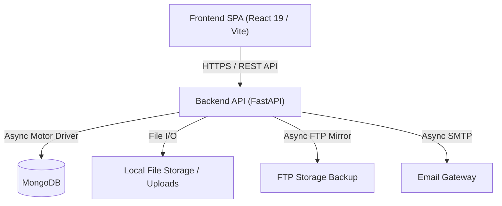

# 01 - Project Overview

## System Context & Executive Summary
The **CMES Manpower Management Portal (CMES_MP)** is an enterprise, multi-tenant workforce compliance and tracking platform designed for managing contractor manpower across diverse geographical regions and industrial sites.

It replaces fragmented spreadsheet-based tracking and uncoordinated registration workflows with a centralized, automated system that enforces strict document lifecycle controls, medical compliance, role-based access, and automated region-scoped approval workflows.

---

## Core Mission & Value Proposition
- **Automated Manpower Lifecycle**: Streamlines onboarding from initial registration draft through admin review, approval, ID generation, renewal management, and offboarding.
- **Strict Compliance Enforcement**: Manages mandatory compliance documents (Medical Test, Height Work, Safety Belt, Extension Rope, PPE Register) and contractor-level compliance (ESI, PF, MSME, GST).
- **Region-Scoped Governance**: Enforces fine-grained data isolation and approval permissions based on user region assignments.
- **Audit & Regulatory Compliance**: Tracks full historical audit logs for all administrative actions, document renewals, format changes, and user status transitions.

---

## Tech Stack Overview

| Layer | Technologies & Tools |
| :--- | :--- |
| **Frontend UI** | React 19, Vite 6, Tailwind CSS, shadcn/ui, Lucide Icons, Sonner |
| **Backend API** | FastAPI (Python 3.10+), Pydantic v2, Motor (Async MongoDB Driver) |
| **Database** | MongoDB (Community / Enterprise) |
| **Authentication** | JWT Bearer Authentication (HTTP-Only Cookie + Header fallback) |
| **Services & Alerts** | Asyncio Background Tasks, aiosmtplib, Jinja2 Email Templates, FTP Storage Mirroring |

---

## Architecture High-Level Diagram

