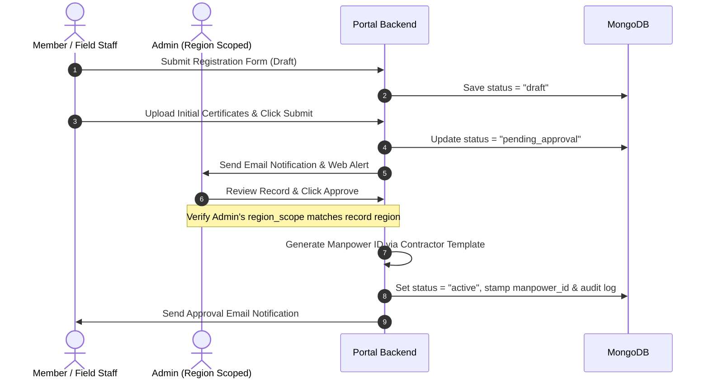
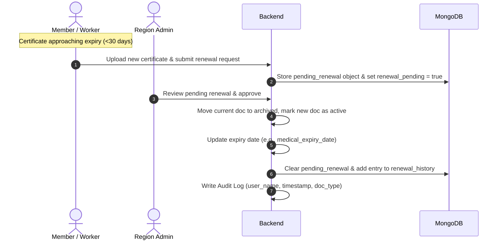
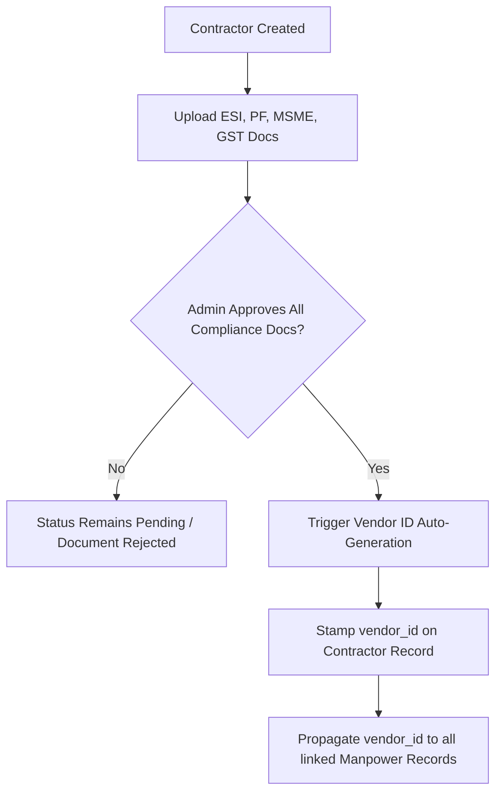

# 06 - Core Business Workflows

## 1. Manpower Onboarding & Approval Workflow

```mermaid
sequenceDiagram
    autonumber
    actor Member as Member / Field Staff
    actor Admin as Admin (Region Scoped)
    participant System as Portal Backend
    participant DB as MongoDB

    Member->>System: Submit Registration Form (Draft)
    System->>DB: Save status = "draft"
    Member->>System: Upload Initial Certificates & Click Submit
    System->>DB: Update status = "pending_approval"
    System->>Admin: Send Email Notification & Web Alert
    Admin->>System: Review Record & Click Approve
    Note over Admin,System: Verify Admin's region_scope matches record region
    System->>System: Generate Manpower ID via Contractor Template
    System->>DB: Set status = "active", stamp manpower_id & audit log
    System->>Member: Send Approval Email Notification
```

---

## 2. Document Renewal Workflow

```mermaid
sequenceDiagram
    autonumber
    actor Member as Member / Worker
    actor Admin as Region Admin
    participant System as Backend
    participant DB as MongoDB

    Note over Member: Certificate approaching expiry (<30 days)
    Member->>System: Upload new certificate & submit renewal request
    System->>DB: Store pending_renewal object & set renewal_pending = true
    Admin->>System: Review pending renewal & approve
    System->>System: Move current doc to archived, mark new doc as active
    System->>System: Update expiry date (e.g., medical_expiry_date)
    System->>DB: Clear pending_renewal & add entry to renewal_history
    System->>System: Write Audit Log (user_name, timestamp, doc_type)
```

---

## 3. Contractor Compliance & Vendor ID Workflow

```mermaid
flowchart TD
    A[Contractor Created] --> B[Upload ESI, PF, MSME, GST Docs]
    B --> C{Admin Approves All Compliance Docs?}
    C -- No --> D[Status Remains Pending / Document Rejected]
    C -- Yes --> E[Trigger Vendor ID Auto-Generation]
    E --> F[Stamp vendor_id on Contractor Record]
    F --> G[Propagate vendor_id to all linked Manpower Records]
```
